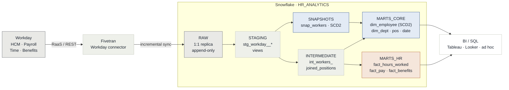

# Workday → Fivetran → dbt → Snowflake: HR Analytics Platform

A production-shaped reference implementation of an HR/Payroll analytics pipeline: **Workday** (source ERP) replicated by **Fivetran** into a **Snowflake** raw layer, transformed with **dbt** into a conformed dimensional model (Kimball-style star schema) ready for BI (Tableau/Looker/Power BI) and ad-hoc SQL analytics.

This repo is a **portfolio/demo project**. It ships realistic (synthetic) Workday-shaped sample data, complete Snowflake DDL, and a working dbt project (staging → intermediate → marts) with tests, docs, a SCD2 snapshot, and CI — so it can be cloned and run end-to-end against any Snowflake trial account.

---

## 1. The business problem

HR and payroll data lives inside Workday, an operational system built for transaction processing, not for cross-domain analysis. Questions like *"which departments are driving overtime costs,"* *"who was this employee's manager on the date of a comp change,"* or *"does our payroll register reconcile to the general ledger"* require joining across HCM, Time Tracking, Payroll, and Benefits — objects that Workday exposes as separate, effective-dated reports, not a queryable warehouse.

This project solves that by building the pipeline that turns Workday into a governed analytics layer: replicate Workday's domains into Snowflake automatically (Fivetran), model them into a conformed, tested **Kimball star schema** (dbt), and preserve history correctly — so an employee's job, manager, and comp band as of *any past date* can still be reconstructed, not just their current state. The result is a warehouse a BI tool or analyst can query directly, with payroll figures precise enough to reconcile to the register.

## 2. Architecture



Orchestrated end-to-end by `dbt build` (`seed → snapshot → run → test`), gated in CI on every pull request (see [§6 Quickstart](#6-quickstart) and [`.github/workflows/dbt_ci.yml`](.github/workflows/dbt_ci.yml)).

**Data flow contract**

| Layer | Owner | Contents | Mutability |
|---|---|---|---|
| `RAW` | Fivetran | 1:1 replica of Workday report/API output + Fivetran metadata columns (`_fivetran_synced`, `_fivetran_deleted`) | Append-only, never edited manually |
| `STAGING` (dbt `stg_`) | dbt | Renamed, typed, light cleaning, one model per source table, materialized as views | Rebuilt every run |
| `INTERMEDIATE` (dbt `int_`) | dbt | Business-logic joins/aggregations not yet ready for BI | Ephemeral/view |
| `MARTS` (dbt `dim_`/`fact_`) | dbt | Conformed dimensions + atomic grain facts, materialized as tables/incremental | Table/incremental, clustered |

See [`docs/architecture.md`](docs/architecture.md) for the full write-up (source domains, Fivetran connector behavior, SCD strategy, warehouse sizing, governance) and [`docs/data_dictionary.md`](docs/data_dictionary.md) for the Workday field → dbt model mapping.

## 3. Repo layout

```
workday-fivetran-dbt-snowflake/
├── README.md
├── docs/
│   ├── architecture.md          # full design doc (10-section consulting brief)
│   ├── data_dictionary.md       # Workday field -> RAW -> staging -> mart mapping
│   └── testing_monitoring_plan.md
├── sample_data/                 # synthetic Workday-shaped CSVs (stand-in for Fivetran RAW sync)
├── snowflake/                   # DDL: databases, schemas, warehouses, RAW tables, stage + COPY INTO
├── dbt_project/
│   ├── dbt_project.yml
│   ├── packages.yml
│   ├── profiles_example.yml
│   ├── models/
│   │   ├── staging/workday/     # stg_workday__*.sql + sources.yml + tests
│   │   ├── intermediate/        # int_*.sql
│   │   └── marts/
│   │       ├── core/            # dim_employee, dim_position, dim_department, dim_date
│   │       └── hr/              # fact_hours_worked, fact_pay, fact_benefits_enrollment
│   ├── snapshots/                # SCD2 snapshot on workers
│   ├── macros/
│   ├── tests/                    # singular tests
│   └── seeds/                    # small reference/lookup CSVs loaded via `dbt seed`
└── .github/workflows/            # CI: sqlfluff lint + dbt build (on PR)
```

## 4. Major components

| Component | Path | What it does |
|---|---|---|
| **Ingest** | [`snowflake/*.sql`](snowflake) | DDL that stands up the database, three warehouses (load / transform / BI), and the `RAW.WORKDAY_*` tables, plus a script to bulk-load the sample CSVs — lets the repo run standalone without a live Fivetran connection. |
| **Staging** | [`models/staging/workday/`](dbt_project/models/staging/workday) | Seven `stg_workday__*` views: 1:1 with each RAW source, renamed to snake_case, typed, deleted-row filtering (`where not _fivetran_deleted`). No joins, no aggregation. |
| **Intermediate** | [`models/intermediate/`](dbt_project/models/intermediate) | `int_workers_joined_positions` — a worker/position/department/location join. **Currently orphaned**: no downstream model `ref()`s it — see [§8 Data lineage findings](#8-data-lineage-findings). |
| **Dimensions** | [`models/marts/core/`](dbt_project/models/marts/core) | `dim_employee` (SCD Type 2, built from a snapshot), `dim_department`, `dim_position`, `dim_location`, `dim_date` (SCD1 / generated) — conformed across every fact. |
| **Facts** | [`models/marts/hr/`](dbt_project/models/marts/hr) | `fact_hours_worked`, `fact_pay`, `fact_benefits_enrollment` — atomic grain, additive measures, incremental materialization keyed on `_fivetran_synced`. |
| **History** | [`snapshots/snap_workers.sql`](dbt_project/snapshots/snap_workers.sql) | dbt snapshot with a timestamp strategy — captures every job/department/manager/comp change to `stg_workday__workers` as it happens, the raw material `dim_employee` is built from. |
| **Quality** | [`tests/`](dbt_project/tests), `schema.yml` | `not_null` / `unique` / `relationships` on every mart key, plus singular tests (`assert_positive_hours`, terminated-employee date checks) and source freshness thresholds. |
| **Reference** | [`macros/`](dbt_project/macros), [`seeds/`](dbt_project/seeds) | `generate_schema_name.sql` maps dbt's target schemas onto the exact `MARTS_CORE` / `MARTS_HR` naming from the architecture doc; `seed_pay_group.csv` is a small static lookup. |
| **Pipeline** | [`.github/workflows/dbt_ci.yml`](.github/workflows/dbt_ci.yml) | On every PR touching `dbt_project/`: `sqlfluff` lints, then `dbt deps → seed → snapshot → build` runs against a dedicated Snowflake `ci` target using key-pair auth from GitHub Secrets. |

## 5. Technologies & frameworks

- **Extract & load:** Workday RaaS / REST API, Fivetran connector
- **Warehouse:** Snowflake — multi-warehouse workload isolation, clustering keys
- **Transform:** dbt-snowflake 1.8, dbt_utils package, dbt snapshots (SCD2), Jinja macros
- **Quality & CI:** sqlfluff (Snowflake dialect), dbt schema + singular tests, GitHub Actions, key-pair auth via Secrets
- **Consumption:** Tableau / Looker / Power BI, dbt docs (lineage), ad-hoc SQL

## 6. Quickstart

**Prereqs:** Snowflake account (trial is fine), `python3.11+`, `pip`.

```bash
# 1. Install dbt
python -m venv .venv && source .venv/bin/activate
pip install dbt-snowflake==1.8.*

# 2. Provision Snowflake objects (run as ACCOUNTADMIN or a role with CREATE DATABASE)
#    Paste snowflake/*.sql into a Snowflake worksheet, in order 00 -> 01 -> 02
#    (02 loads sample_data/*.csv via PUT + COPY INTO, simulating a Fivetran initial sync)

# 3. Configure dbt connection
cp dbt_project/profiles_example.yml ~/.dbt/profiles.yml
#    edit with your account/user/role/warehouse; use a key-pair or SSO, never plaintext prod passwords

# 4. Run
cd dbt_project
dbt deps
dbt seed
dbt snapshot
dbt build          # runs models + tests
dbt docs generate && dbt docs serve
```

In a real deployment, step 2 is performed by the **Fivetran Workday connector** on a schedule (see [`docs/architecture.md#2-fivetran-connector`](docs/architecture.md)) — the SQL here exists purely so this repo is runnable standalone without a live Fivetran account.

## 7. Execution flow, start to finish

Two flows run this repo: the **data pipeline** (production cadence) and **CI** (every pull request).

1. **Workday emits a change** — a worker's job, a time entry, a pay result, or a benefits election changes inside Workday's HCM/Payroll/Time/Benefits domains.
2. **Fivetran syncs it to RAW** — the Workday connector pulls via RaaS/REST under a read-only Integration System User and lands rows in `RAW.WORKDAY_*`, tagged with `_fivetran_synced`. Cadence: 6h (HCM/Position) · 1h (Time Entry, in-period) · 24h (Benefits).
3. **`dbt seed` & `dbt snapshot` run** — `dbt seed` refreshes static lookups; `dbt snapshot` compares `stg_workday__workers` against `snap_workers` and inserts new SCD2 history rows for anything that changed. Trigger: after Fivetran sync completes (webhook or freshness poll).
4. **`dbt run` builds staging → intermediate → marts** — staging views normalize RAW; `int_workers_joined_positions` joins worker and position; marts materialize `dim_*` (table) and `fact_*` (incremental) from the snapshot and staging layers.
5. **`dbt test` validates the build** — schema tests on every PK/FK plus singular business-rule tests run before the build is considered good; a failure blocks the marts from being trusted downstream.
6. **BI queries the marts** — Tableau/Looker/Power BI or ad-hoc SQL hits `MARTS_CORE` / `MARTS_HR` through the isolated `WH_BI_QUERY` warehouse — never touching RAW or STAGING directly.
7. **In parallel, every pull request:** GitHub Actions lints changed models with sqlfluff, then runs `dbt deps → seed → snapshot → build` against a dedicated Snowflake `ci` schema — the same DAG as production, run on synthetic data before merge.

## 8. Data lineage findings

A model-by-model trace of every `ref()`/`source()` in `dbt_project/` (sources → staging → intermediate → snapshot → dims → facts) turned up a few things worth knowing before you build on this repo:

- **`int_workers_joined_positions` is orphaned.** Its header comment claims it "feeds `dim_employee`," but nothing `ref()`s it — `dim_employee` duplicates the same worker/position/department/location join directly against the staging models instead. The join logic is maintained in two places; either wire the intermediate model into `dim_employee` or delete it.
- **Facts join `dim_employee` on `is_current`, not the point-in-time version.** `fact_hours_worked`, `fact_pay`, and `fact_benefits_enrollment` all filter `dim_employee` to `where is_current` when resolving `employee_key` — a fact row links to *today's* employee attributes, not the SCD2 version that was active on the transaction date.
- **Facts conform to `dim_date` by value, not by `ref()`.** Each fact computes its own `date_key` as `generate_surrogate_key(entry_date | pay_period_end_date | effective_date)` rather than joining `dim_date` — this matches by construction (both use the same hash of the same date) but isn't a declared foreign key relationship dbt would test.
- **No semantic layer ships in the repo.** There's no dbt Semantic Layer, no `semantic_models:`/`metrics:` definitions, and no `exposures.yml`. `MARTS_CORE`/`MARTS_HR` are the last thing dbt builds; any metric logic lives wherever the consuming BI tool defines it.
- **No dashboards ship in the repo.** Tableau/Looker/Power BI are named as the intended consumers (via the isolated `WH_BI_QUERY` warehouse) but no workbook/view files exist here — the trail this repo actually builds ends at the marts.

## 9. What this demonstrates (for reviewers)

- Kimball dimensional modeling: conformed `dim_employee`, `dim_department`, `dim_position`, `dim_date`; atomic-grain `fact_hours_worked`, `fact_pay`, `fact_benefits_enrollment`
- SCD Type 2 on `dim_employee` via a dbt snapshot (job/comp/manager history), SCD Type 1 on low-cardinality reference dims
- Layered dbt architecture (staging/intermediate/marts) with `ref()`-only lineage, no cross-layer skipping
- Data quality: schema tests (`unique`, `not_null`, `relationships`, `accepted_values`), a custom singular test, and source freshness checks
- Snowflake specifics: clustering keys on large facts, a right-sized warehouse per workload, `COPY INTO` bulk load, RAW/STAGING/ANALYTICS schema separation
- CI: lint (sqlfluff) + `dbt build` against a Snowflake CI database on every PR

## 10. License

MIT — see [`LICENSE`](LICENSE). Sample data is entirely synthetic; no real Workday tenant or employee data is used.
