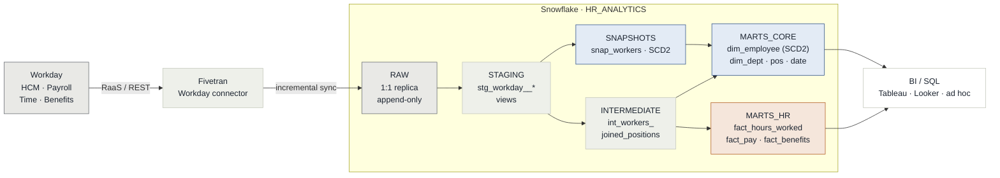

# Workday → Fivetran → dbt → Snowflake: HR Analytics Platform

A production-shaped reference implementation of an HR/Payroll analytics pipeline: **Workday** (source ERP) replicated by **Fivetran** into a **Snowflake** raw layer, transformed with **dbt** into a conformed dimensional model (Kimball-style star schema) ready for BI (Tableau/Looker/Power BI) and ad-hoc SQL analytics.

This repo is a **portfolio/demo project**. It ships realistic (synthetic) Workday-shaped sample data, complete Snowflake DDL, and a working dbt project (staging → intermediate → marts) with tests, docs, a SCD2 snapshot, and CI — so it can be cloned and run end-to-end against any Snowflake trial account.

---

## 1. Architecture



Orchestrated end-to-end by `dbt build` (`seed → snapshot → run → test`), gated in CI on every pull request (see [§3 Quickstart](#3-quickstart) and [`.github/workflows/dbt_ci.yml`](.github/workflows/dbt_ci.yml)).

**Data flow contract**

| Layer | Owner | Contents | Mutability |
|---|---|---|---|
| `RAW` | Fivetran | 1:1 replica of Workday report/API output + Fivetran metadata columns (`_fivetran_synced`, `_fivetran_deleted`) | Append-only, never edited manually |
| `STAGING` (dbt `stg_`) | dbt | Renamed, typed, light cleaning, one model per source table, materialized as views | Rebuilt every run |
| `INTERMEDIATE` (dbt `int_`) | dbt | Business-logic joins/aggregations not yet ready for BI | Ephemeral/view |
| `MARTS` (dbt `dim_`/`fact_`) | dbt | Conformed dimensions + atomic grain facts, materialized as tables/incremental | Table/incremental, clustered |

See [`docs/architecture.md`](docs/architecture.md) for the full write-up (source domains, Fivetran connector behavior, SCD strategy, warehouse sizing, governance) and [`docs/data_dictionary.md`](docs/data_dictionary.md) for the Workday field → dbt model mapping.

## 2. Repo layout

```
workday-fivetran-dbt-snowflake/
├── README.md
├── docs/
│   ├── architecture.md          # full design doc (10-section consulting brief)
│   ├── data_dictionary.md       # Workday field -> RAW -> staging -> mart mapping
│   └── testing_monitoring_plan.md
├── sample_data/                 # synthetic Workday-shaped CSVs (stand-in for Fivetran RAW sync)
├── snowflake/                   # DDL: databases, schemas, warehouses, RAW tables, stage + COPY INTO
├── dbt_project/
│   ├── dbt_project.yml
│   ├── packages.yml
│   ├── profiles_example.yml
│   ├── models/
│   │   ├── staging/workday/     # stg_workday__*.sql + sources.yml + tests
│   │   ├── intermediate/        # int_*.sql
│   │   └── marts/
│   │       ├── core/            # dim_employee, dim_position, dim_department, dim_date
│   │       └── hr/              # fact_hours_worked, fact_pay, fact_benefits_enrollment
│   ├── snapshots/                # SCD2 snapshot on workers
│   ├── macros/
│   ├── tests/                    # singular tests
│   └── seeds/                    # small reference/lookup CSVs loaded via `dbt seed`
└── .github/workflows/            # CI: sqlfluff lint + dbt build (on PR)
```

## 3. Quickstart

**Prereqs:** Snowflake account (trial is fine), `python3.11+`, `pip`.

```bash
# 1. Install dbt
python -m venv .venv && source .venv/bin/activate
pip install dbt-snowflake==1.8.*

# 2. Provision Snowflake objects (run as ACCOUNTADMIN or a role with CREATE DATABASE)
#    Paste snowflake/*.sql into a Snowflake worksheet, in order 00 -> 01 -> 02
#    (02 loads sample_data/*.csv via PUT + COPY INTO, simulating a Fivetran initial sync)

# 3. Configure dbt connection
cp dbt_project/profiles_example.yml ~/.dbt/profiles.yml
#    edit with your account/user/role/warehouse; use a key-pair or SSO, never plaintext prod passwords

# 4. Run
cd dbt_project
dbt deps
dbt seed
dbt snapshot
dbt build          # runs models + tests
dbt docs generate && dbt docs serve
```

In a real deployment, step 2 is performed by the **Fivetran Workday connector** on a schedule (see [`docs/architecture.md#2-fivetran-connector`](docs/architecture.md)) — the SQL here exists purely so this repo is runnable standalone without a live Fivetran account.

## 4. What this demonstrates (for reviewers)

- Kimball dimensional modeling: conformed `dim_employee`, `dim_department`, `dim_position`, `dim_date`; atomic-grain `fact_hours_worked`, `fact_pay`, `fact_benefits_enrollment`
- SCD Type 2 on `dim_employee` via a dbt snapshot (job/comp/manager history), SCD Type 1 on low-cardinality reference dims
- Layered dbt architecture (staging/intermediate/marts) with `ref()`-only lineage, no cross-layer skipping
- Data quality: schema tests (`unique`, `not_null`, `relationships`, `accepted_values`), a custom singular test, and source freshness checks
- Snowflake specifics: clustering keys on large facts, a right-sized warehouse per workload, `COPY INTO` bulk load, RAW/STAGING/ANALYTICS schema separation
- CI: lint (sqlfluff) + `dbt build` against a Snowflake CI database on every PR

## 5. License

MIT — see [`LICENSE`](LICENSE). Sample data is entirely synthetic; no real Workday tenant or employee data is used.
